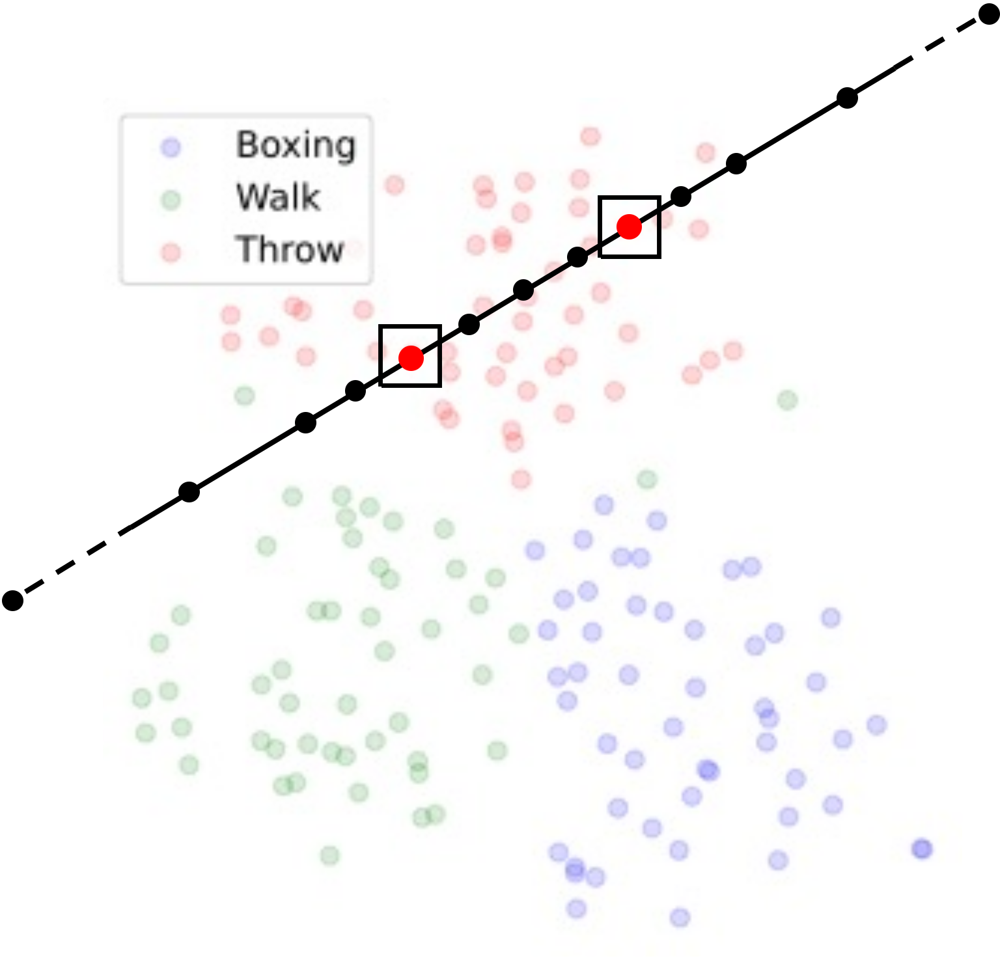
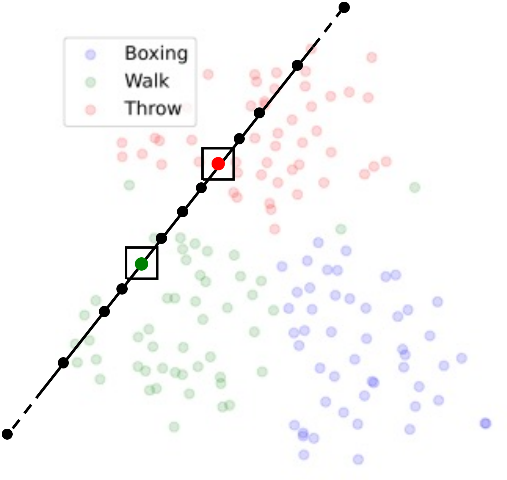

# Human Motion Analysis: Exploring Language-Motion Integration for Motion Editing
We are in the process of putting code/animations created for this project together. 
The current changes can be found in [MDM](https://github.com/KU-ATIA-Projects/motion-diffusion-model) and [MLD](https://github.com/KU-ATIA-Projects/motion-latent-diffusion).

## 5.1 Pre-experiments: text-to-motion generation result comparison
## 5.2 Latent space exploration

<table>

<tr>
<td>
<object data="" type="image/svg+xml" width="100%" height="500px">
  
</object>

</td>
<td>

<object data="" type="image/svg+xml" width="100%" height="500px">
  
</object>

</td>
</tr>
<tr>
<td>Intra-cluster Interpolation</td>
<td>Inter-cluster Interpolation</td>
</tr>
</table>
Schematic Diagram of Latent Space Interpolation: The diagram illustrates two scenarios of interpolation in the latent space - (a) between 'Throw' and 'Throw', and (b) between 'Throw' and 'Walk'.
    For both (a) and (b), the points in the rectangular box represent the initial motion, with three evenly interpolated points in between. 
    Additionally, points are plotted along the extension line of the two original actions, at a quarter, a half, one, and ten times the length between the original points.
<figure>
        <video controls loop>
          <source src="./5_2_latent_space_exploration/MLD/result_basic.mp4" type="video/mp4">
          Your browser does not support the video tag.
        </video>
        <figcaption>Figure 20: Generation of Motion from Latent Space: The figure showcases the generation of three distinct motions – 'Walk', 'Throw', and 'Boxing' – derived from their corresponding clusters in the latent space</figcaption>
      </figure>

<figure>
        <video controls loop>
          <source src="./5_2_latent_space_exploration/MLD/result_basic_render.mp4" type="video/mp4">
          Your browser does not support the video tag.
        </video>
        <figcaption>Rendered Versions of Generated Motions: This figure presents the rendered versions of the 'Walk', 'Throw', and 'Boxing' motions generated from the latent space, as depicted in Fig. 20. Rendered implementation is detailed on the project page.</figcaption>
      </figure>

<figure>
        <video controls loop>
          <source src="./5_2_latent_space_exploration/MLD/result_throw_throw_int.mp4" type="video/mp4">
          Your browser does not support the video tag.
        </video>
        <figcaption>From left to right: (a)Quarter extrapolation beyond 'Throw' action (right hand). (b)Original 'Throw' action, right hand. (c)First interpolation between 'Throw' actions. (d)Second interpolation between 'Throw' actions. (e)Third interpolation between 'Throw' actions. (f)Original 'Throw' action, left hand. (g)Quarter extrapolation beyond 'Throw' action (left hand). 
        Visual Representation of Interpolated and Extrapolated Values: the figure showcases a series of continuous interpolation and extrapolation positions depicted from left to right. Figures (a) and (g) showcase extrapolated actions progressing slower than the originals on their side. Figures (c), (d), and (e) demonstrate a transition that falls between the original actions. All interpolated and extrapolated figures trend towards closely resembling one side of the original actions.</figcaption>
      </figure>

<figure>
        <video controls loop>
          <source src="./5_2_latent_space_exploration/MLD/result_throw_throw_ext.mp4" type="video/mp4">
          Your browser does not support the video tag.
        </video>
        <figcaption>From left to right: (a)Ten times extrapolation value beyond 'Throw' action. (b)One time extrapolation value beyond 'Throw' action. (c)Half time extrapolation value beyond 'Throw' action. (d)Original 'Throw' action, right hand. (e)Original 'Throw' action, left hand. (f)Half time extrapolation value beyond 'Throw' action (left hand). (g)One time extrapolation value beyond 'Throw' action (left hand). (h)Ten times extrapolation value beyond 'Throw' action (left hand).  
        Visual Representation of Extrapolated Values: the figure showcases a series of continuous extrapolation positions depicted from left to right. The ten times extrapolated figures (a) and (h) depict complete motion transformations. In figures (b) and (c), the further the motion is from the original (d), the slower it becomes and the more pronounced the drift. The same principles apply to figures (f) and (g). All extrapolated figures tend to resemble the original figures that are closer to one side.</figcaption>
      </figure>

<figure>
        <video controls loop>
          <source src="./5_2_latent_space_exploration/MLD/result_throw_walk_int.mp4" type="video/mp4">
          Your browser does not support the video tag.
        </video>
        <figcaption>From left to right: (a)Quarter Extrapolation towards 'Walk' action from 'Throw'. (b)Original 'Throw' action. (c)First interpolation between 'Throw' and 'Walk' actions. (d)Second interpolation between 'Throw' and 'Walk' actions. (e)Third interpolation between 'Throw' and 'Walk' actions. (f)Original 'Walk' action. (g)Quarter Extrapolation beyond 'Walk' action from 'Throw'.  
        Visual Representation of Interpolated and Extrapolated Values: the figure showcases a series of continuous interpolation and extrapolation positions depicted from left to right. Figures (a) and (g) showcase extrapolated actions progressing slower than the originals on their side. Figures (c), (d), and (e) demonstrate a transition that falls between the original actions. All interpolated and extrapolated figures trend towards closely resembling one side of the original actions.</figcaption>
      </figure>

<figure>
        <video controls loop>
          <source src="./5_2_latent_space_exploration/MLD/result_throw_walk_ext.mp4" type="video/mp4">
          Your browser does not support the video tag.
        </video>
        <figcaption>From left to right: (a)Ten times extrapolation towards 'Walk' action from 'Throw'. (b)One time extrapolation towards 'Walk' action from 'Throw'. (c)Half time extrapolation towards 'Walk' action from 'Throw'. (d)Original 'Throw' action. (e)Original 'Walk' action. (f)Half time extrapolation beyond 'Walk' action from 'Throw'. (g)Ten times extrapolation beyond 'Walk' action from 'Throw'. (h). 
        Visual Representation of Interpolation and Extrapolation between 'Throw' and 'Walk' actions: the figure showcases a series of continuous extrapolation positions depicted from left to right. The ten times extrapolated figures (a) and (h) depict complete action transformations. In figures (b) and (c), the further the action is from the original (d), the slower it becomes and the more pronounced the drift. The same principles apply to figures (f)One time extrapolation beyond 'Walk' action from 'Throw' and (g). All extrapolated figures tend to resemble the original figures that are closer to one side.</figcaption>
      </figure>

### 5.2.1 Latent space exploration of MLD
### 5.2.2 Latent space exploration on MDM
## 5.3 Prompt-based motion editing
## 5.4 Ablations
### Data filtering approach
